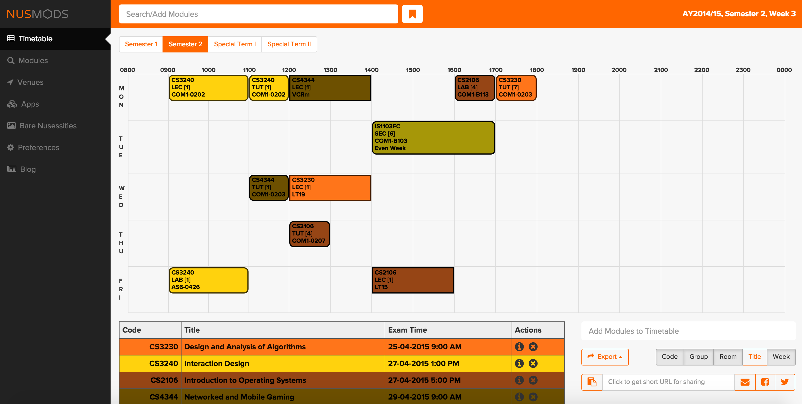
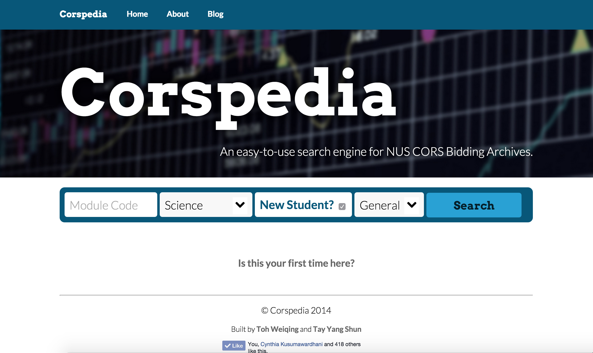

NUSMods: How did a student-built application become so popular?
===

If you are an NUS student, you must have heard of NUSMods.  It is likely that NUSMods has become such a big part of your life that you can’t even survive school without it. But one thing you might not know is that this immensely useful web application was actually built by students! Surprise! (ok, at least for an NTU student like me!) Digital Senior is very privileged to speak to the current developer behind NUSMods, Yang Shun and let you have a peek behind the scenes.

### Tell us more about yourself

I’m an NUS student in my final year. Initially I was from Faculty of Engineering but I found that it Computer Science modules were really interesting and thus took the leap and changed courses. I think that decision was one of the best ones I have made in my life. After switching courses, I was involved in mobile apps development, and went on a one-year stint on the NUS Overseas College Programme at Silicon Valley. I came back to Singapore as a better developer, equipped with skills and experience in web and mobile development. In June of 2014, I  joined NUSMods and integrated more features into it.

### How did NUSMods came about?

NUSMods was started by Beng Hee, a fellow NUS student from School of Computing and is currently working in Google New York. The timetable builder provided by the school wasn’t satisfactory as it wasn't really user friendly. Students in the past have developed timetabling solutions in the form of Windows desktop client but they were not cross-platform. It was then in 2012, when Beng decided to build NUSMods, a web-based solution for to solve the timetabling needs of students.

After I joined the team, we revamped the interface and pushed out more features. Since August 2014, Beng graduated from NUS and the responsibility of maintaining and expanding NUSMods lied with me. Often, I try to align development of NUSMods with my school projects so that I can kill two birds with one stone: fulfill school commitments and also to continue developing NUSMods.

### How did you get involved?

NUSMods is the largest student-initated project in the school so far as it practically involves the whole student population.

Before NUSMods, together with Weiqing, a friend from Industrial Systems Engineering, I founded this website called Corspedia which aims to present bidding statistics of the modules in NUS in an easily digestable manner. NUS releases the bidding statistics by the bidding round, which wasn't helpful for cross-semester comparisons. Hence, Corspedia obtained the public statistics from the school site and presented it in a format that made more sense by comparing bidding points across semesters for a single module. One of the first few things I did was to integrate Corspedia into NUSMods.

As I also have an interest in visual design and communication, one of the others things I did when I first started was to give the user interface a visual refresh and increased the branding, by coming up with a logo and using making our Facebook page consistent with the new style of NUSMods.

### Can you share some user statistics of NUSMods?

From Google Analytics, in January 2015, around 66,000 different devices accessed it and close to 2 million pageviews.

### What are the selling points of NUSMods that attracted so many users ?

In my opinion, the NUSMods is really pleasant to use and provides users with an intuitive interface. As students ourselves, we understand the common workflows taken by students and have made them easy to execute on NUSMods. The timetable provided by the school requires many clicks and refreshing of the page to get things done, whereas NUSMods uses an autocomplete style to add modules and a drag-and-drop style of manipulating modules, which is much easier than what is provided by the school. NUSMods also aims to be a one-stop platform by using the school's publicly available information and presenting them in an easily consumable fashion. It includes module information that you can get from the school’s websites such as lecturers, course details description, prerequisites etc. There are module reviews contributed by our own students as well, which helps users make more informed decisions and more information before taking a module.

### Speaking of module reviews, there were a couple of other review sites that are no longer in operation because it is too challenging to put that together. How did you all overcome that challenge? 

Many people would find it intimidating or too much effort required to write a review because they think that for it to be meaningful, it has to be at least 3-4 paragraphs long. We tackle this problem from a different angle, and try to encourage students to write “micro-reviews”, like what Foursquare is doing with their reviews of places. It is acceptable for a review to be few lines long, as long as it is truthful and useful.

In this semester break itself, we received over 200 over reviews from our students! NUSMods ran a module review competition within the school. People who wrote the best reviews would win cash prizes. There are also a few categories, such as creativity, humour, etc. For our module review function, I used the Disqus plugin where people can embed picture/videos in their review. It also comes with a moderator feature as well; it's a really nice service to use.

### How does NUSMods work ?

All the information displayed on NUSMods is taken from the school’s official source.

Users don’t have to set up an account to use NUSMods. Their data stored locally within your browser. We understand that some students may not be so comfortable with revealing their personal information.

Regarding the module information, Beng wrote scripts to access the school websites, retrieve the information, parse them and stored them. We update our information hourly on weekdays so that everyone can get the most updated information. It runs on its own perfectly well, unless the school’s website changes format, which does not happen regularly.

Students can then access NUSMods on any modern web browser and use it to build their timetables and look up module information.

### What did you all do to market NUSMods ? 

So far we haven't done much to spread NUSMods among the students, the growth is purely organic. I guess students would recommend useful applications with their friends and especially since NUSMods outperforms the alternatives. Some lecturers also add links to NUSMods from their module sites as well. We mainly use Facebook to reach out to our users. Please [like us on Facebook](https://www.facebook.com/NUSMods)!

### Who are the people working on NUSMods now?

I'm currently the main maintainer of the client application, but I managed to know a few very talented freshmen, Liu Xinan, Xu Bili and Hong Lu, who have contributed features and patches over December. Because we host our source code on Github, the code is open-sourced and issues are also public. Developers interested to help out can view the issues they are interested in fixing and can submit a patch and I'll integrate them after reviewing them. You can check out [http://NUSMods.com/contribute/developers](http://NUSMods.com/contribute/developers) for a whole list of people who have contributed to NUSMods.

It used to be tough to get contributors because web development wasn’t taught in school, but currently, School of Computing does offer some modules that teach web development. One of the main reasons is that web development skills highly increases the students' employability.

NUSMods can really achieve much more with help from the student community. Anyone interested to help with NUSMods can join our developer group on Facebook [here](https://www.facebook.com/groups/nusmods/).

### What motivates you to work on NUSmods?

Passion. A passion for building things and creating cool stuff. It's extremely satisfying to build something that people use, especially so when my friends are part of these users.

### Is NUSMods making money? If not, do you plan to do so ?

We don’t want to serve advertisements as it distract users with bombarding of extra information. We haven’t came out with a viable business model as of yet but we're currently exploring.

### What plans do you have for NUSMods?

I hope to improve as much as possible before I start working. The next huge release would be user login, so that users can store their time tables in our servers and they can view access their timetables on others devices, such as their smartphones.

On a related note, support for timetable merging is a highly requested feature.  It would allow users to coordinate project meetings. If you can save your friend’s timetable, you can view their free time slots and compare them with your own and identify common free times lots for meeting or lunch gatherings.

We are also considering a forum and a more customized module review system.

However, We face the restriction of not being able to tap into schools official data .i.e. module materials otherwise NUSMods would be able to do even more useful things.

### Many people are now discouraged from joining Computer Science because a lot of programming work is outsourced to overseas contractors. Would you recommend juniors to join Computer Science?

It depends on their interest. If students have an interest in Maths, Physics, or building things in general, do try our Computer Science. Take some introductory programming course online for example. You might just get hooked onto it!

In the local tech scene, there is a severe lack of talent as many bright JC graduates want to study the prestigious courses like Medicine, Dentistry and Law. The prospects of a career is Computer Science is increasingly bright as technology has become so ubiquitous in our lives.

### What will you do when you graduate?

I'm undecided as of now, but joining a fast-moving startup company sounds like a really fun thing to do. I like to make improvements to the products I built but MNCs are slow to implement changes. For example, in NUSMods, if I think of something I want to improve within the system, I can work on it immediately and it's possible that it ges live and in the hands of the users the next day. Startups offer a similar kind of experience.